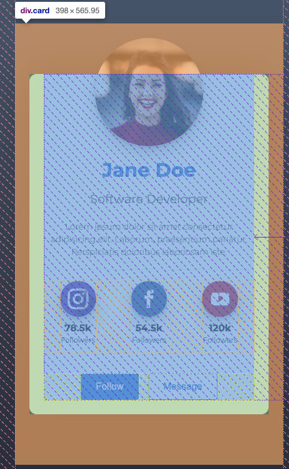
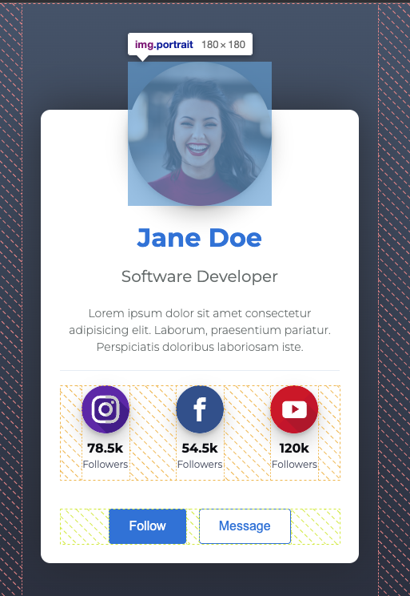
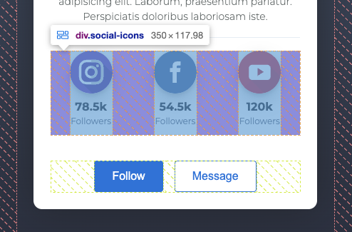

# Workshop 1

## Main goal:
The main objective of the activity is to implement the proposed design.

Expected results

    Project Created in Git
    Implementation of features branches:
        Feature: profile-header
        Feature: profile-body
        Feature: profile-footer

You can download the assets here

Styles - Fonts

    blue: #3c7ade
    white: #fff
    gray: #717777
    font: 'Montserrat', Helvetica, Arial, sans-serif
    text-color: #2d3142
    page background color: linear-gradient from #4f5d75, to #2d3142

Suggested Dimensions:
 ### Card

 ### Picture

 ### Icons

 ### Final Product

