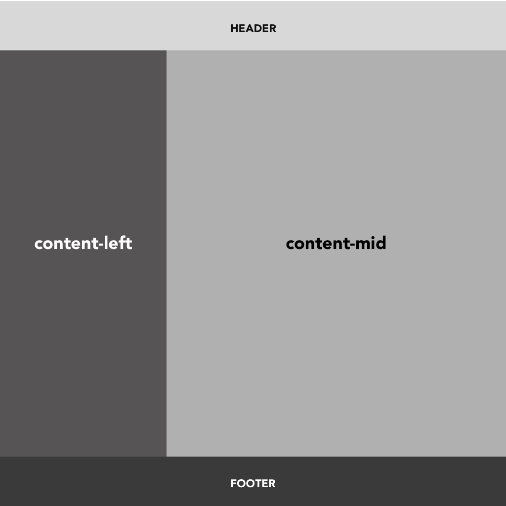
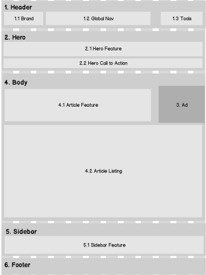

#Practica de HTML - CSS layout

Hola maker este será nuestro segundo ejercicio práctico de HTML y CSS. 

Este proyecto, cuenta con tres niveles de práctica usando HTML y CSS. El objetivo es intentar acercarse lo más posible al diseño de la imagen. Los archivos de imagen serviran de referencia de cómo debería verse el resultado. No se preocupe si su código no coincide exactamente con la solución. Siempre que se parezca a la imagen proporcionada, lo estás haciendo bien.
Recomendaciones para el desarrollo del taller

* Ten a la mano tus apuntes, las guias, o cualquier recurso que te sirva para consultar aquello que no te acuerdes.
* Se vale buscar en internet!! pero busca la información que te ayude a lograr la misión no busques la solución del ejercicio.
* Si estás bloqueado, busca apoyo, no te dejes desanimar.

Pasos a seguir para el desarrollo del ejercicio

  * Para cada ejercicio debes crear una carpeta independiente con el nombre que corresponda al layout. ej layout1.
* Para cada layout debes crear el archivo index.html y el archivo de estilos.
* Cree la estructura HTML.
* Linkee el css con su archivo HTML.
* Identifique las secciones del layout.
* Cree los indetificadores que considere necesarios para la implementación del CSS (id-clases).
* Aplique los estilos.

### ATENCIÓN

Como buenos desarrolladores siempre nos preocupamos por implementar buenas prácticas.

Asegurate de indentar correctamente el código.
Utiliza etiquetas semánticas siempre que sea posible (header, main, section, sidebar, footer, etc.).
Asegurate de mantener un código css lógico y ordenado.

### Expected results

#### Layout 1

#### Layout 2

#### Layout 3

